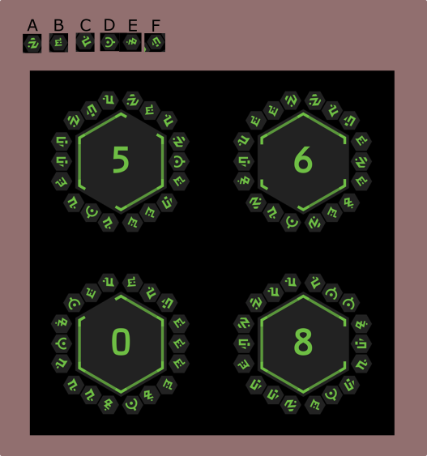

# Saucers
a repo dedicated to holding data and solving the "hot saucers" puzzles for Fortnite Season 7.

## installation:
- clone repo
- change dir into repo
- execute a `cargo run` in the directory
  - default output binary gets tossed into target/debug/\<binary>

## features
- more of an engine at the moment; currently grabs tag values nicely. (right now it's set to output the first tag of the first edge of the first tile, which is mapped to "a".)
  - example can be found in `tile.json` for data input.
  - data input is based on this scheme, read from the top of a hexagon clockwise.
  
  <sub>image credit: Epic Games | mari's "we'll get more tomorrow" post from the Fortnite Official discord</sub>

  <br>

  - `tile.json`
    ```json
    {
        "tile_center": "5",
        "tile_edges": {
            "edge_a": {
                "is_open": true,
                "tag": {
                    "tag_1": "a",
                    "tag_2": "b",
                    "tag_3": "c"
                }
            },
            "edge_b": {
                "is_open": false,
                "tag": {
                    "tag_1": "a",
                    "tag_2": "d",
                    "tag_3": "b"
                }
            },
            "edge_c": {
                "is_open": false,
                "tag": {
                    "tag_1": "c",
                    "tag_2": "b",
                    "tag_3": "b"
                }
            },
            "edge_d": {
                "is_open": true,
                "tag": {
                    "tag_1": "c",
                    "tag_2": "d",
                    "tag_3": "c"
                }
            },
            "edge_e": {
                "is_open": false,
                "tag": {
                    "tag_1": "b",
                    "tag_2": "f",
                    "tag_3": "f"
                }
            },
            "edge_f": {
                "is_open": false,
                "tag": {
                    "tag_1": "a",
                    "tag_2": "f",
                    "tag_3": "c"
                }
            }
        }
    }
    ```
<sub>neither i nor any involved with the operations of this repository are affilliates with the Fortnite Franchise, Epic, or any related subsidiaries. all art and related IP of the aforementioned Franchise(s), Compan(ies) and Subsidiar(ies) belongs to it's respectful owner(s). </sub>